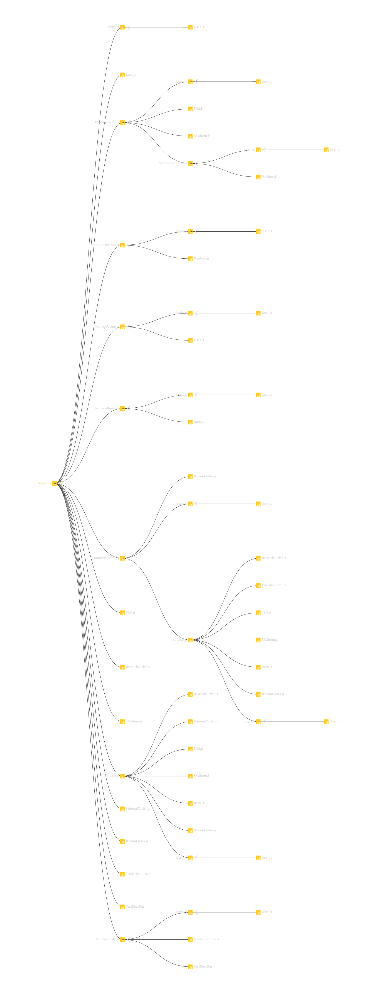

# Integration and API Test Report

Date:

Version:

# Contents

- [Dependency graph](#Dependency graph)

- [Integration approach](#integration)

- [Tests](#tests)

- [Scenarios](#scenarios)

- [Coverage of scenarios and FR](#scenario-coverage)
- [Coverage of non-functional requirements](#nfr-coverage)

# Dependency graph 

 

     
# Integration approach

    <Write here the integration sequence you adopted, in general terms (top down, bottom up, mixed) and as sequence
    (ex: step1: class A, step 2: class A+B, step 3: class A+B+C, etc)> 
    <Some steps may  correspond to unit testing (ex step1 in ex above), presented in other document UnitTestReport.md>
    <One step will  correspond to API testing>

    The integration sequence used is the bottom up. Tests start from the module that directly interacts with the database in the app logic (tested by the function written in the unit_test folder) and ends in the API test. Tests are structured as follows.

#  Integration Tests

   <define below a table for each integration step. For each integration step report the group of classes under test, and the names of
     Jest test cases applied to them, and the mock ups used, if any> Jest test cases should be here 'code/server/unit_test' 

### Step 1
| Classes  | mock up used |Jest test cases |
|--|--|--|
|ManageOrders|-|testDeleteRestockOrders()|
|||testGetAllRestockOrder()|
|||testGetAllRestockOrder()|
|||testGetIssuedRestockOrder()|
|||testCreateRestockOrder()|
|||testUpdateStatus())|
|||testInsertSKUItems()|
|||testInsertTransportNote()|
|||testGetRestockOrderById()|
|||testGetItemsFromRestockOrderById()|
|||testGetAllReturnOrders()|
|||testGetReturnOrderById()|
|||testCreateReturnOrder()|
|||testDeleteReturnOrder()|
|||testGetAllInternalOrders()|
|||testGetIssuedInternalOrders()|
|||testGetAcceptedInternalOrder()|
|||testGetInternalOrderById()|
|||testCreateInternalOrder()|
|||testUpdateInternalOrder()|
|||testDeleteInternalOrder()|

## Step 2
| Classes  | mock up used |Jest test cases |
|--|--|--|
|ManageOrders + service|-|testGetRestockOrdersAPI()|
|||testGetIssuedRestockOrdersAPI()|
|||testGetRestockOrderByIdAPI()|
|||testGetItemsFromRestockOrderByIdAPI()|
|||testGetAllReturnOrderAPI()|
|||testGetReturnOrderByIdAPI()|
|||testGetInternalOrdersAPI()|
|||testGetIssuedInternalOrdersAPI()|
|||testGetAcceptedInternalOrdersAPI()|
|||testGetInternalOrderByIdAPI()|

## Step n 

   
| Classes  | mock up used |Jest test cases |
|--|--|--|
||||

ManageTests,ManageSKUs, ManageItems, ManagePosition and ManageUsers have 1 single step, so a proper integration test is not possible

# API testing - Scenarios

<If needed, define here additional scenarios for the application. Scenarios should be named
 referring the UC in the OfficialRequirements that they detail>

## Scenario UCx.y

| Scenario |  name |
| ------------- |:-------------:| 
|  Precondition     |  |
|  Post condition     |   |
| Step#        | Description  |
|  1     |  ... |  
|  2     |  ... |

# Coverage of Scenarios and FR

<Report in the following table the coverage of  scenarios (from official requirements and from above) vs FR. 
Report also for each of the scenarios the (one or more) API Mocha tests that cover it. >  Mocha test cases should be here code/server/test

| Scenario ID | Functional Requirements covered | Mocha  Test(s) | 
| ----------- | ------------------------------- | ----------- | 
| 5.3.1, 5.3.3| FR5                             |updating skuItems in a restock order |             
| 5.3.2       |                                 |Updating a restock order             |             
| 3.1, 3.2    |                                 |Creating a restock order             |             
| 6.1,6.2     |                                 |Adding a return order                |             
|             |                                 |Deleting a return order              |             
| 1-1        |  FR2.1                              |  Creating an SKU           | 
| 1-2        | FR2.1                               |  Updating an SKU   position        |      
| 1-3        |   FR2.1                             |    Updating an SKU         |    
| 2-1        |   FR3.1.1                             |   Creating a position          |    
| 2-2        |   FR3.1.1                             |   Updating a position id          |    
| 2-3        | FR3.1.1                               |    Updating a position         | 
| 2-4        | FR3.1.1                               |    Updating a position         |  
| 2-5        |   FR3.1.2                             |  Deleting a position         |    
| 4-1        |   FR1.1                             |    Creating a user         |          
| 4-2        |    FR1.1                            |    Updating a user         |    
| 4-3        |     FR1.2                           |     Deleting a user        |    
| 11-1       |     FR7                           |    Creating an item         |    
| 11-2        |     FR7                           |    Updating an item         | 
| 9.3         | FR6                             |Updating an internal order           |             
| 9.1         |                                 |Creating an internal order           | 
|             |                                 |Deleting an internal order           | 
|             |                                 |Updating a test descriptor           | 
|             |                                 |Deleting a test descriptor           | 
|             |                                 |Adding  a test descriptor            | 
| 5.2.3       | FR3.2,FR3.2.2                   |Updating a test result               | 
|             | FR3.2.3                         |Deleting a test result               | 
| 5.2.1,5.2.2 | FR3.2.1                         |Adding  a test  result               |   

# Coverage of Non Functional Requirements

<Report in the following table the coverage of the Non Functional Requirements of the application - only those that can be tested with automated testing frameworks.>

### 

| Non Functional Requirement | Test name |
| -------------------------- | --------- |
|    NFR4 |    Creating a position|
|   NFR5                         |     Creating an SKU      |
|    NFR6|     Creating an SKUitem|

