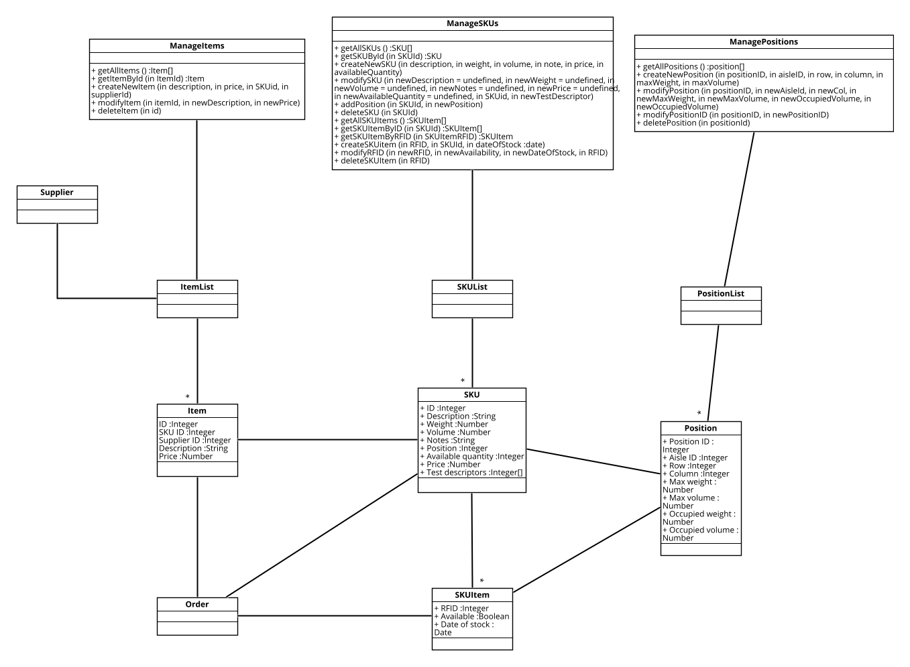
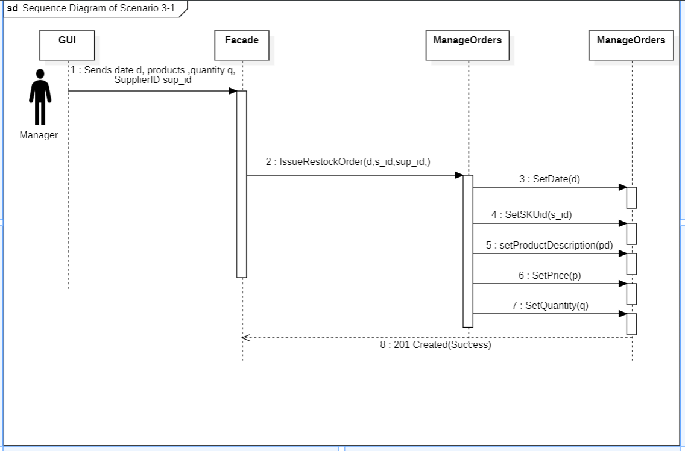

# Design Document 

Authors: 

Date:

Version:

# Contents

- [High level design](#package-diagram)
- [Low level design](#class-diagram)
- [Verification traceability matrix](#verification-traceability-matrix)
- [Verification sequence diagrams](#verification-sequence-diagrams)

# Instructions

The design must satisfy the Official Requirements document, notably functional and non functional requirements, and be consistent with the APIs

# High level design 

It is the High Level design for Easy Warehouse application. A three tier architecture has been chosen, and all the classes and connection are reported in the diagram below. A Facade Design Pattern has been chosen, to make easier and more maintainable the code.

# Low level design

In this paragraph, are designed the Application Logic Tier and the Data Layer Tier.

## Application Logic Tier

## Data Tier

### Order and test model

### SKU and Items model

### User and session model

# Verification traceability matrix

|| ManageOrder | ManagePosition | ManageSKUs | ManageItems | ManageSession | ManageUsers | ManageTest |
|---|---|---|---|---|---|---|---|
| FR1 |||||| X ||
| FR2 ||| X |||||
| FR3 || X ||||| X |
| FR4 |||||| X ||
| FR5 | X | X | X |||| X |
| FR6 | X |||||||
| FR7 |||| X ||||

# Verification sequence diagrams 

### Sequence Diagram of Scenario 1-1

### Sequence Diagram of Scenario 2-2

### Sequence Diagram of Scenario 3-1

### Sequence Diagram of Scenario 5-2-1

### Sequence Diagram of Scenario 6-1

### Sequence Diagram of Scenario 9-1

