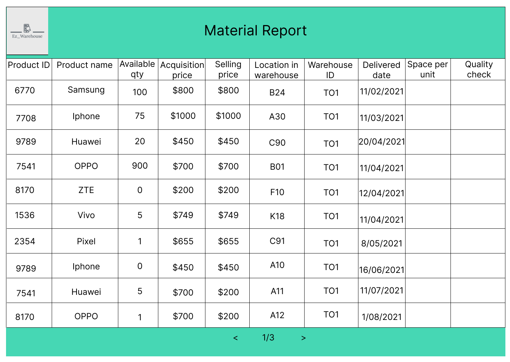

# Graphical User Interface Prototype  

Authors:

Date:

Version:

<<<<<<< HEAD
\<Report here the GUI that you propose. You are free to organize it as you prefer. A suggested presentation matches the Use cases and scenarios defined in the Requirement document. The GUI can be shown as a sequence of graphical files (jpg, png)  >

=======
# Login page
The system automatically recognizes the type of user (manager/supplier/OU) and navigates to the dedicated page.

# Internal Order
List of available products in the warehouse that are available for internal order 

### The Employee is considered as manager or Organizational Unit, because they have the same interface

# Supplier's Product List
List of products offered by supplier

# External Order
Notification list for products in shortage:
 

 
# Material Report

"Material report1"

# Quality check

"Quality check1"

# List of orders of Manager, Supplier, OU

"Figma Source"

# Registration form
Registration form for the manager/supplier.

Registration form for the warehouse. Warehouse ID is generated upon successful completion of form. The manager is automatically binded to the warehouse.
  
>>>>>>> s305388/EzWh-master
