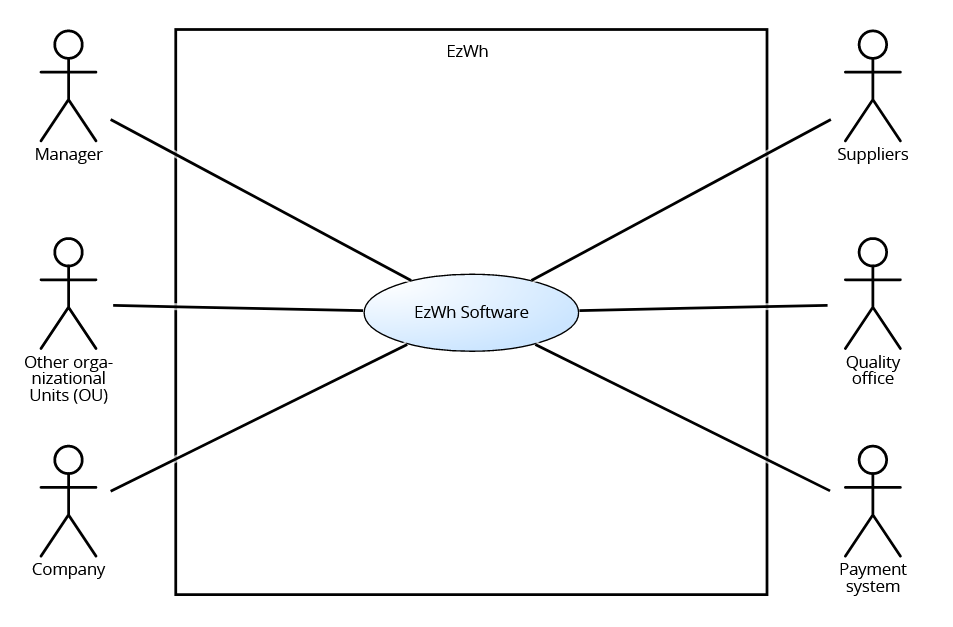
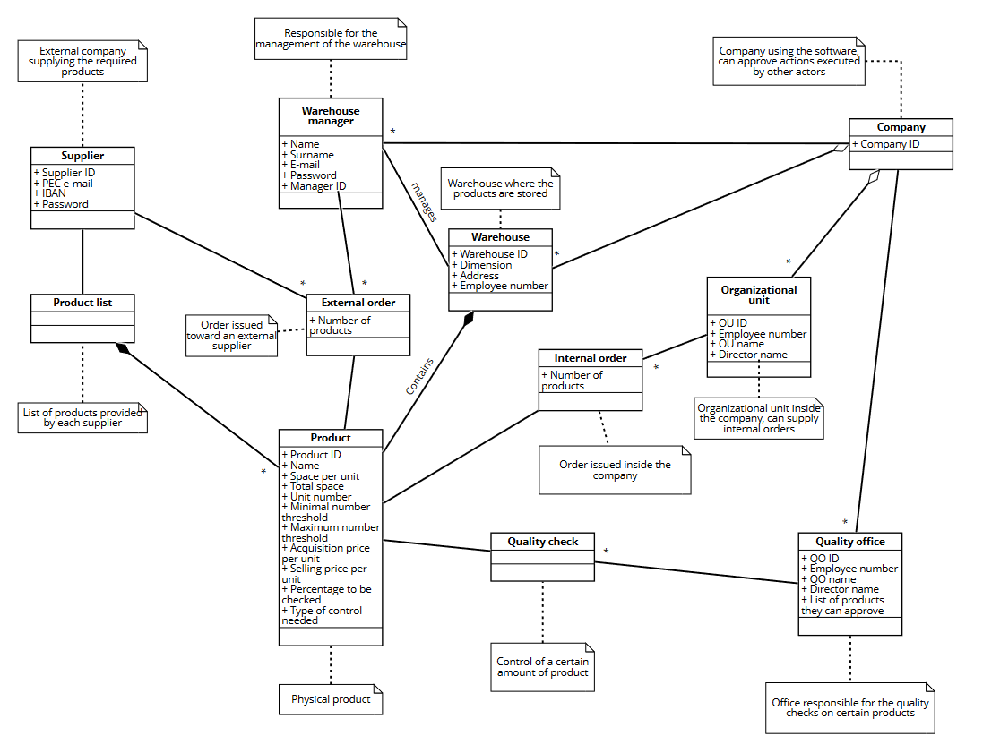
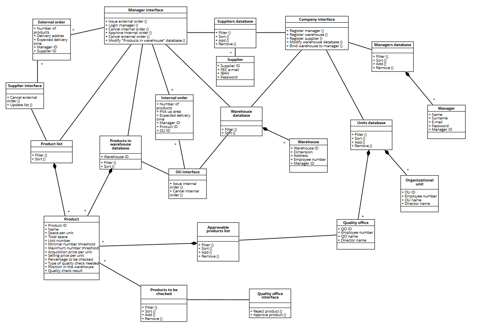
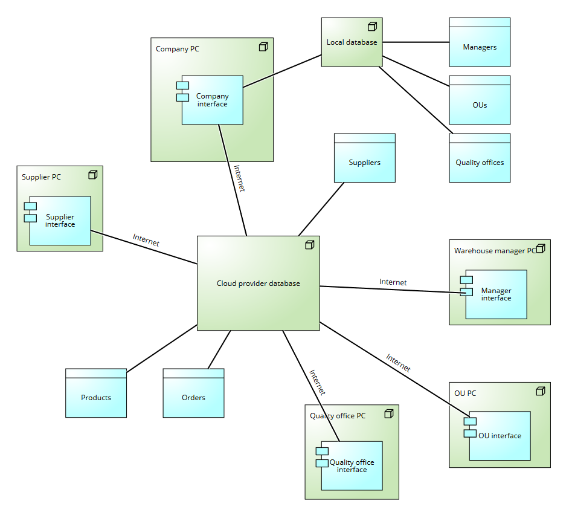

 #Requirements Document 

Date: 22 march 2022

Version: 0.0

 
| Version number | Change |
| ----------------- |:-----------|
| | | 

# Contents

- [Informal description](#informal-description)
- [Stakeholders](#stakeholders)
- [Context Diagram and interfaces](#context-diagram-and-interfaces)
	+ [Context Diagram](#context-diagram)
	+ [Interfaces](#interfaces) 
	
- [Stories and personas](#stories-and-personas)
- [Functional and non functional requirements](#functional-and-non-functional-requirements)
	+ [Functional Requirements](#functional-requirements)
	+ [Non functional requirements](#non-functional-requirements)
- [Use case diagram and use cases](#use-case-diagram-and-use-cases)
	+ [Use case diagram](#use-case-diagram)
	+ [Use cases](#use-cases)
    	+ [Relevant scenarios](#relevant-scenarios)
- [Glossary](#glossary)
- [System design](#system-design)
- [Deployment diagram](#deployment-diagram)

# Informal description
Medium companies and retailers need a simple application to manage the relationship with suppliers and the inventory of physical items stocked in a physical warehouse. 
The warehouse is supervised by a manager, who supervises the availability of items. When a certain item is in short supply, the manager issues an order to a supplier. In general the same item can be purchased by many suppliers. The warehouse keeps a list of possible suppliers per item. 

After some time the items ordered to a supplier are received. The items must be quality checked and stored in specific positions in the warehouse. The quality check is performed by specific roles (quality office), who apply specific tests for item (different items are tested differently). Possibly the tests are not made at all, or made randomly on some of the items received. If an item does not pass a quality test it may be rejected and sent back to the supplier. 

Storage of items in the warehouse must take into account the availability of physical space in the warehouse. Further the position of items must be traced to guide later recollection of them.

The warehouse is part of a company. Other organizational units (OU) of the company may ask for items in the warehouse. This is implemented via internal orders, received by the warehouse. Upon reception of an internal order the warehouse must collect the requested item(s), prepare them and deliver them to a pick up area. When the item is collected by the other OU the internal order is completed. 

EZWH (EaSy WareHouse) is a software application to support the management of a warehouse.

# Stakeholders

| Stakeholder name  | Description | 
| ----------------- |:-----------:|
| Manager |supervisor of the warehouse|
| Company | owns the warehouse|
| Supplier | receives orders |
| Quality Office | Checks for the quality of delievered products|
| OU |Makes internal orders|
| Payment System | Delivers payment services (passive actor)|
| Database management service | Owns databases |
| Competitors | Similar products or similar applications|
| Physical delivery system | Delivers orders |

# Context Diagram and interfaces

## Context Diagram
\<Define here Context diagram using UML use case diagram>

\<actors are a subset of stakeholders>

## Interfaces
\<describe here each interface in the context diagram>

\<GUIs will be described graphically in a separate document>

| Actor | Logical Interface | Physical Interface  |
| ------------- |:-------------:| -----:|
|  Manager | GUI | computer, tablet |
|  OU | GUI | computer |
|  Supplier | GUI | computer |
|  Quality office | GUI | Quality control machine, computer |
|  Payment System | Internet | POS |
|  Company | GUI | computer |

# Stories and personas
\<A Persona is a realistic impersonation of an actor. Define here a few personas and describe in plain text how a persona interacts with the system>
## Manager

Checks which product is meeded, he can choose from a list of suppliers for that product.
Places orders.

## Organizational Unit

Places internal orders to the warehouse, if the product is actually in the warehouse.

## Supplier

Manages recieved orders. 
Notify if he can supply a specific object.

## Quality Office

Checks the quality of products.
Makes a report: if the report is positive, the product is accepted. If it negative, the product is sent back.

## Payment System

Manages all transactions: it can accept or refuse a transaction.

\<Persona is-an-instance-of actor>

\<stories will be formalized later as scenarios in use cases>

# Functional and non functional requirements

## Functional Requirements

\<In the form DO SOMETHING, or VERB NOUN, describe high level capabilities of the system>

\<they match to high level use cases>

| ID        | Description  |
| ------------- |:-------------:| 
|  FR1     |  Material management |
|  FR1.1   |  Check availability of products |
|  FR1.2   |  Update the stock |
|  FR1.3   |  Filter the products |
|  FR1.4   |  Track position of different products|
|  FR2     |  Order placement |
|  FR3     |  Suppliers can notify products availability | 
|  FR4     |  Internal orders management |
|  FR5	   |  Quality check management |
|  FR5.1   |  Reject bad quality products delivery |
|  FR6     |  Manage payments |

## Non Functional Requirements

\<Describe constraints on functional requirements>

| ID        | Type (efficiency, reliability, ..)           | Description  | Refers to |
| ------------- |:-------------:| :-----:| -----:|
|  NFR1     |  Usability | Simple interface, easy to learn  | all of them |
|  NFR2     |  Efficiency | Fast response time, under 0.5 sec(it depends on internet connection) | all of them |
|  NFR3     |  Correctness | The code is heavily tested | all of them |
|  NFR4     |  Reliability | Frequent databse updates| FR1, FR3 |
|  NFR5     |  Mantainability | Well documented code | All of them |
|  NFR6     |  Security | Authorization, authentication, non-repudiation of actors | all of them |
|  NFR7     |  Safety | Dangerour or hazardous products are labeled | FR1, FR4, FR5 |

# Use case diagram and use cases

## Use case diagram
\<define here UML Use case diagram UCD summarizing all use cases, and their relationships>

\<next describe here each use case in the UCD>
### Use case 1, External Order

| Actors Involved        | Supplier, manager, payment system, quality office |
| ---------- |:-------------:| 
|  Precondition     | Absence of the needed quantity of a product, presence of enough space |
|  Post condition     | Products succesfully stored |
|  Nominal Scenario     | The manager is notified that a certain product is missing and issues an order. When the product is received the quality office checks it, if they're ok it's stored. (Scenario 1.1)|
|  Variants     | If the products does not pass the quality office check, it can be sent back and reordered form another supplier |
|  Exceptions     | The payment system rejects the payment. So the supplier waits for a successful payment |
||A particular version of a product isn't available. If a new version exists it's notified and sent, else the product is not sent and the payment is rejected |
||The system is not updated|

##### Scenario 1.1

| Scenario 1.1 | A product is ordered and succesfully stored|
| ------------- |:-------------:| 
|  Precondition     | Product is needed, there is enough space to satisfy the request|
|  Post condition     |  Product correctly stored |
| Step#        | Description  |
|  1     | The system notifies the manager that a product is needed|  
|  2     | The manager searches for the best supplier (best supplier is chosen based on faster delivery time, lower price... )|
|  3     | The manager issues the order and makes a succesfull payment |
|  4     | The products are delivered |
|  5     | Quality check is passed successfully|
|  6     | Products are stored and registered|

##### Scenario 1.2
| Scenario 1.2 | Not enough space for the product |
| ------------- |:-------------:| 
|  Precondition     |Manager wants to make an order, but there isn't enough space |
|  Post condition   | Order not accomplished|
| Step#        | Description  |
|  1     | Manager tries to make an order for too much product |  
|  2     | The order is aborted by the system |

##### Scenario 1.3

| Scenario 1.3 | Payment is refused |
| ------------- |:-------------:| 
|  Precondition     | Product is ordered and there is enough space |
|  Post condition   | Order is refused |
| Step#        | Description  |
| 1  |  Manager issues an order |
| 2  |  The payment is processed|
| 3  |  Payment is refused|
| 4  |  The system refuses the order (the manager is notified)|

##### Scenario 1.4

| Scenario 1.4 | Product doesn't  reach the warehouse|
| ------------- |:-------------:| 
|  Precondition     |Product is ordered succesfully |
|  Post condition     | The order has to be reissued|
| Step#        | Description  |
| 1 | The product is ordered|
| 2 | The product isn't delivered or doesn't pass the quality check|
| 3 | The manager and the supplier are notified about the problem|

### Use case 2, Internal order
| Actors Involved        | OU, Manager|
| ------------- |:-------------:| 
|  Precondition     | An OU needs a product|
|  Post condition     |The OU receives the product|
|  Nominal Scenario     | An OU needs a product, checks for its presence in the Warehouse and orders it, the manager confirms the order and the product is delivered|
|  Variants     | Concurrent Orders|
|  Exceptions   | Product not available|

##### Scenario 2.1

| Scenario 2.1 | Order is succesfully completed|
| ------------- |:-------------:| 
|  Precondition     | A product is available and needed by one single OU |
|  Post condition     | Product is delivered|
| Step#        | Description  |
| 1 |   OU needs a product |
| 2 |   OU checks if the product is available in the warehouse |
| 3 | 	OU orders the product |
| 4 |   Manager accepts the order|
| 5 |   Product is prepared and delivered to the pick up area |
| 6 |   OU picks up the items from the dedicated area |

##### Scenario 2.2

| Scenario 2.2 | Product not available|
| ------------- |:-------------:| 
|  Precondition     | An OU needs a product |
|  Post condition     | Order is rejected and has to be reissued|
| Step#        | Description  |
| 1 | OU tries to make an order for a product|
| 2 | The system notifies the unavailability of the product to the OU and the manager|
| 3 | The order is refused and has to be reissued |
| 4 | The OU chooses another warehouse in the company (if present)|

##### Scenario 2.3

| Scenario 2.3 | Product not available|
| ------------- |:-------------:| 
|  Precondition     | An OU needs a product |
|  Post condition     | Product is delivered |
| Step#        | Description  |
| 1 | OU tries to make an order for a product|
| 2 | The system notifies the unavailability of the product to the OU and the manager|
| 3 | The order is refused|
| 4 | The OU asks to the warehouse to make an external order for that product|
| 5 | The manager issues an external order | 
| 6 | The manager receives the external order|
| 7 | The manager accepts the internal order|
| 8 | Product is prepared and delivered to the pick up area |
| 9 | OU picks up the items from the dedicated area |

##### Scenario 2.4

| Scenario 2.4 | Product not available|
| ------------- |:-------------:| 
|  Precondition     | An OU needs a product |
|  Post condition     | Product is not delivered|
| Step#        | Description  |
| 1 | OU tries to make an order for a product|
| 2 | The system notifies the unavailability of the product to the OU and the manager|
| 3 | The order is refused|
| 4 | The OU asks to the warehouse to make an external order for that product|
| 5 | The manager issues an external order | 
| 6 | The external order is rejected|
| 7 | The manager notifies it to the OU|
| 8 | The internal order is rejected |

##### Scenario 2.5

| Scenario 2.5 | Concurrent orders|
| ------------- |:-------------:| 
|  Precondition     | Multiple OUs need the same products |
|  Post condition     |  As many orders as possible are fulfilled |
| Step#        | Description  |
| 1 |   Multiple OUs order the same product|
| 2 |	The manager accepts the internal orders following a FIFO queue|
| 3 |	If some OU orders cannot be satisfied, their orders are rejected|

<<<<<<< HEAD
### Use case 3, Quality check

| Actors Involved        | Quality office, warehouse manager|
| ------------- |:-------------:| 
|  Precondition     |  A product is delivered to the company |
|  Post condition     |  The product is stored in the warehouse|
|  Nominal Scenario     | A product is delivered to the company, the product is checked by the quality office and if approved it's stored in the warehouse|
|  Variants     |  If the quality check is not passed the order has to be reissued|
|  Exceptions     | |

##### Scenario 3.1

| Scenario 3.1 | Quality check is succesfully passed|
| ------------- |:-------------:| 
|  Precondition     |  A product is delivered to the company|
|  Post condition     | The product is stored in the warehouse|
| Step#        | Description  |
| 1 |   A product is delivered to the company |
| 2 |   The product is checked by the quality office (if necessary)|
| 3 |   The product is approved and the manager is notified|
| 4 |   The product is stored in the warehouse and registered |

##### Scenario 3.2

| Scenario 3.2 | Quality check isn't passed by the product|
| ------------- |:-------------:| 
|  Precondition     | A product is delivered to the company|
|  Post condition     |  The product is stored in the warehouse|
| Step#        | Description  |
| 1 |   A product is delivered to the company |
| 2 |   The product is checked by the quality office |
| 3 |   The product is rejected due to some defect|
| 4 |   The manager is notified of the problem |
| 5 |   The manager repeats the order procedure until the product passes the check|
| 6 |   The product is stored in the Warehouse and registered |

### Use case 4, Suppliers upload a product list
| Actors Involved        | Suppliers|
| ------------- |:-------------:| 
|  Precondition     |  The list of products a supplier can produce changes |
|  Post condition     |  The system is updated with the new list|
|  Nominal Scenario     | A particular supplier decides to change the products they provide, so they update the list known by the system|
|  Variants     |  Only informations about a product is changed (but not the product itself)|
||  A completely new list is uploaded to the system|
|  Exceptions     | |

##### Scenario 4.1

| Scenario 4.1 | Suppliers updates the product list|
| ------------- |:-------------:| 
|  Precondition     |The list of products a supplier cand produce changes|
|  Post condition     |  The system is updated with the new list|
| Step#        | Description  |
| 1 |   A particular supplier decides to change the products they provide |
| 2 |   They add new products or remove deprecated ones one by one|
| 3 |   The system is updated|

##### Scenario 4.2

| Scenario 4.2 | Suppliers changes info about a product|
| ------------- |:-------------:| 
|  Precondition     |  Some detail about a certain product changes |
|  Post condition     | The system is updated with the new informations|
| Step#        | Description  |
| 1 |   A particular supplier decides to change some details about a product they provide |
| 2 |   They look for the product on the system|
| 3 |   They change the information on that product |
| 4 |   The system is updated|

##### Scenario 4.3

| Scenario 4.3 | Suppliers upload a new product list|
| ------------- |:-------------:| 
|  Precondition     | The list of products a supplier can produce changes or a new suplier uploads it's first list|
|  Post condition     |  The system is updated with the new list|
| Step#        | Description  |
| 1 |   A particular supplier wants to cmpletely change their product list |
| 2 |   They add a new list of product, removing the old one (if present) |
| 3 |   The system is updated|

### Use case 5 - Company registers supplier
| Actors Involved        |Supplier, Payment system, Company|
| ------------- |:-------------:| 
|  Precondition     | Supplier doesn't have an account|
|  Post condition   | Supplier has an account |
|  Nominal Scenario | To use the application correctly, every user has to have an account |
|  Variants     | The supplier doesn't receive the notification, the list is not correctly formed|
|  Exceptions   | |

##### Scenario 5.1
| Scenario 5.1 | Supplier registration |
| ------------- |:-------------:|
|  Precondition     | A supplier doesn't have an account |
|  Post condition     | A supplier has an account |
| Step#        | Description  |
| 1 | The company registers the supplier |
| 2 | The company sends to the supplier username and password|
| 3 | The supplier logins |
| 4 | The supplier adds indormation about payment (IBAN)|
| 5 | The payment system accepts the payment information |
| 6 | The supplier uploads its own product list|
| 7 | The list is uploaded correctly|

##### Scenario 5.2
| Scenario 5.2 | Supplier doesn't receive email |
| ------------- |:-------------:|
|  Precondition     | A supplier doesn't have an account |
|  Post condition     | A supplier has an account |
| Step#        | Description  |
| 1 | The company registers the supplier |
| 2 | The company sends to the supplier email and password|
| 3 | The supplier doesn't receive the notification |
| 4 | The supplier asks for new notification |
| 5 | The company sends again to the supplier email and password |
| 6 | The supplier logins |
| 7 | The supplier adds indormation about payment (IBAN)|
| 8 | The payment system accepts the payment information |
| 9 | The supplier uploads its own product list|
| 10| The list is uploaded correctly|

##### Scenario 5.3
| Scenario 5.3 |The list is not correctly formed|
| ------------- |:-------------:|
|  Precondition     | A supplier doesn't have an account |
|  Post condition     | Account created, but the warehouse sees an empty list of products |
| Step#        | Description  |
| 1 | The company registers the supplier |
| 2 | The company sends to the supplier email and password|
| 3 | The supplier logins |
| 4 | The supplier adds indormation about payment (IBAN)|
| 5 | The payment system accepts the payment information |
| 6 | The supplier uploads its own product list|
| 7 | The list is not correctly formed | 

### Use case 6 - Warehouse registration
| Actors Involved |Company, Manager, Payment system|
| ------------- |:-------------:| 
|  Precondition     | The warehouse is not registered into the Company databases and manager has an account|
|  Post condition   | The warehouse is correctly registered |
|  Nominal Scenario | The manager registers his warehouse |
|  Variants     | Invalid data(email, password ...)|
|  Exceptions   | |

##### Scenario 6.1
| Scenario 6.1 | Warehouse registration |
| ------------- |:-------------:|
|  Precondition     |The warehouse is not registered into the Company databases and manager has his own account |
|  Post condition     | The warehouse is registered |
| Step#        | Description  |
| 1 | The manager executes login|
| 2 | The manager inserts warehouse's address|
| 3 | The manager inserts the number of employees |
| 4 | The manager inserts the entire space available |
| 5 | The manager inserts the warehouse's code |
| 6 | The manager inserts payment data|
| 7 | The payment system approves the payment data | 
| 9 | The company approves the new warehouse|
|10 | The company binds the manager information to the warehouse code |

##### Scenario 6.2

| Scenario 6.2 | Warehouse's address is wrong |
| ------------- |:-------------:|
|  Precondition     |The warehouse is not registered into the Company databases and manager has his own account |
|  Post condition     | Registration failed |
| Step#        | Description  |
| 1 | The manager executes login|
| 2 | The manager inserts warehouse's address|
| 3 | The address is wrong|
| 4 | The registration is canceled|

##### Scenario 6.3

| Scenario 6.3 | The company doesn't approve the new warehouse |
| ------------- |:-------------:|
|  Precondition     |The warehouse is not registered into the Company databases and manager has his own account |
|  Post condition     | Registration failed and the manager receives a report |
| Step#        | Description  |
| 1 | The manager executes login|
| 2 | The manager inserts warehouse's address|
| 3 | The manager inserts the number of employers |
| 4 | The manager inserts the entire space available |
| 5 | The manager inserts the warehouse's code |
| 6 | The company doesn't approve the new warehouse |
| 7 | The company writes a report to notify the reason|
| 8 | The company sends the report to the manager |

### Use Case 7 - Manager registration

| Actors Involved |Company, Manager|
| ------------- |:-------------:| 
|  Precondition     | The manager has not an account |
|  Post condition   | The manager has an account |
|  Nominal Scenario | Company creates a manager account |
|  Variants     | The manager doesn't receive the notification |
|  Exceptions   | |

##### Scenario 7.1
| Scenario 7.1 | Manager registration |
| ------------- |:-------------:|
|  Precondition    |The manager doesn't have an account |
|  Post condition  | The manager has an account and logins |
| Step#        | Description  |
| 1 | The company registers the manager|
| 2 | The company binds the manager with a warehouse |
| 3 | The company sends to the manager username, password and warehouse code|
| 4 | The manager logins |

#### Scenario 7.2

| Scenario 7.2 | The manager doesn't receive the notification|
| ------------- |:-------------:|
|  Precondition     |The manager has not their own account |
|  Post condition     | The manager logins |
| Step#        | Description  |
| 1 | The company registers the manager|
| 2 | The company binds the manager with a warehouse |
| 3 | The company sends to the manager username, password and warehouse code|
| 4 | The manager doesn't receive the notification |
| 4 | The manager asks for new notification |
| 5 | The company sends again to the supplier email and password |
| 6 | The manager logins |

### Use Case 8 - Manager and warehouse binding
| Actors Involved        |Manager, Company|
| ------------- |:-------------:| 
|  Precondition     | Manager is not binded to their warehouse|
|  Post condition   | Manager has their warehouse |
|  Nominal Scenario | All managers have to be registered and binded with a warehouse |
|  Variants     |  |
|  Exceptions   | Invalid data(Warehouse ID)|

#### Scenario 8.1

| Scenario 8.1 | The manager and their warehouse are correctly binded |
| ------------- |:-------------:|
|  Precondition     | The manager has an account |
|  Post condition   | Manager and warehouse correctly binded|
| Step#        | Description  |
| 1 | The company receives the warehouse registration |
| 2 | The company confirms if the warehouse specified by the manager is free|
| 3 | The company updates their databases |

#### Scenario 8.2
| Scenario 8.2 | The manager and their warehouse are not correctly binded |
| ------------- |:-------------:|
|  Precondition     | The manager has an account and the specified warehouse is not free |
|  Post condition   | Manager and warehouse correctly binded|
| Step#        | Description  |
| 1 | The company receives the warehouse registration |
| 2 | The warehouse id is wrong |
| 3 | The company notifies it to the manager|

### Use Case 9 - Manager Login
| Actors Involved        |Manager|
| ------------- |:-------------:| 
|  Precondition     | The manager has an account|
|  Post condition   | The manager is logged in |
|  Nominal Scenario | The manager has to be logged in to use every service|
|  Variants     |  |
|  Exceptions   | Incorrect data(company email, password, warehouse id)|

#### Scenario 9.1 
| Scenario 9.1 | The login is correctly completed |
| ------------- |:-------------:|
|  Precondition     | The manager has an account |
|  Post condition   | The manager is logged in|
| Step#        | Description  |
| 1 | The manager enters their company email|
| 2 | The manager enters their password|
| 3 | The manager enters the warehouse code |
| 4 | The manager is logged in |

#### Scenario 9.2 
| Scenario 9.2 | The login is not correctly completed |
| ------------- |:-------------:|
|  Precondition     | The manager has an account |
|  Post condition   | The manager is not logged in|
| Step#        | Description  |
| 1 | The manager enters their company email|
| 2 | The email is wrong | 

#### Scenario 9.3 
| Scenario 9.3 | The login is not correctly completed |
| ------------- |:-------------:|
|  Precondition     | The manager has an account |
|  Post condition   | The manager is not logged in|
| Step#        | Description  |
| 1 | The manager enters their company email|
| 2 | The manager enters their password |
| 3 | The password is wrong |
| 4 | The login in not completed |

#### Scenario 9.4
| Scenario 9.4 | The login is not correctly completed |
| ------------- |:-------------:|
|  Precondition     | The manager has an account |
|  Post condition   | The manager is not logged in|
| Step#        | Description  |
| 1 | The manager enters their company email|
| 2 | The manager enters their password |
| 3 | The manager enters the warehouse code |
| 4 | The code is wrong|
| 5 | The login is not completed|

### Use Case 10 - Internal order cancellation

| Actors Involved        |OU, Manager|
| ------------- |:-------------:| 
|  Precondition     | The OU has issued an order |
|  Post condition   | The order is cancelled |
|  Nominal Scenario | There are errors in an order, so the order has to be canceled|
|  Variants     ||
|  Exceptions   | the order has missing products |

#### Scenario 10.1

| Scenario 10.1 | The manager cancels the order  |
| ------------- |:-------------:|
|  Precondition     | The OU has issued an order, the order has not been sent |
|  Post condition   | The order is canceled |
| Step#        | Description  |
| 1 | The manager logins |
| 2 | The manager searches for the order in the list of orders |
| 3 | The order has not been sent|
| 4 | The manager cancels the order |
| 5 | The OU is notified and receives a report about the cancellation |

#### Scenario 10.2

| Scenario 10.2 | The OU cancels the order |
| ------------- |:-------------:|
|  Precondition     | The OU has issued an order, the order has not been sent |
|  Post condition   | The order is canceled |
| Step#        | Description  |
| 1 | The OU checks the state of the order |
| 2 | The order has not been sent |
| 3 | The OU asks for the cancellation of the order |
| 4 | The manager cancels the order |
| 5 | The manager udpdates database |

#### Scenario 10.3

| Scenario 10.3 | The order has been already sent |
| ------------- |:-------------:|
|  Precondition     | The OU has issued an order, the order has been already sent |
|  Post condition   | The order is sent back |
| Step#        | Description  |
| 1 | The OU checks the state of the order |
| 2 | The order has been sent |
| 3 | The OU asks for the cancellation of the order and reports the reason |
| 4 | The manager cancels the order |
| 5 | The manager asks to the OU to send back the order |
| 6 | The quality office checks if the order is intact and if in the package there are all the products that have been sent |
| 7 | The quality office reports if there are some missing products |

### Use Case 11 - External order cancellation

| Actors Involved        |Supplier, Manager, Payment system|
| ------------- |:-------------:| 
|  Precondition     | The Manager has issued an order |
|  Post condition   | The order is cancelled |
|  Nominal Scenario | There are errors in an order, so the order has to be canceled|
|  Variants     ||
|  Exceptions   | the order has missing products |

#### Scenario 11.1 

| Scenario 11.1 | The order has not been sent and it is correctly cancelled |
| ------------- |:-------------:|
|  Precondition     | The manager has issued an order, the order has not been already sent |
|  Post condition   | The order is canceled |
| Step#        | Description  |
| 1 | The manager has issued an order |
| 2 | The manager checks the state of an order |
| 3 | The order has not been sent |
| 4 | The manager cancels the order |

#### Scenario 11.2

| Scenario 11.2 | The order has been sent and it is correctly cancelled |
| ------------- |:-------------:|
|  Precondition     | The manager has issued an order, the order has not been already sent |
|  Post condition   | The order is correctly canceled |
| Step#        | Description  |
| 1 | The manager has issued an order |
| 2 | The manager checks the state of an order |
| 3 | The order has been sent |
| 4 | The payment has been approved by the Payment System|
| 5 | The manager cancels the order |
| 6 | The manager asks to the supplier for the refund |
| 7 | The supplier accepts the refund | 
| 8 | The supplier asks to the manager to send back the order | 
| 9 | The manager sends back the order | 

#### Scenario 11.3
| Scenario 11.2 | The supplier cancels the order |
| ------------- |:-------------:|
|  Precondition     | The manager has issued an order, the order has not been already sent |
|  Post condition   | The order is correctly canceled |
| Step#        | Description  |
| 1 | The manager has issued an order |
| 2 | The supplier has to cancel the order|
| 3 | The manager is notified about the problem|

### Use Case 12 - Supplier Login
| Actors Involved        |Supplier|
| ------------- |:-------------:| 
|  Precondition     | The supplier has an account |
|  Post condition   | The supplier is logged in |
|  Nominal Scenario | The supplier logins correctly |
|  Variants     | The supplier inserts invalid parameters |
|  Exceptions   | |

#### Scenario 12.1
| Scenario 12.1 | The supplier logins correctly |
| ------------- |:-------------:|
|  Precondition     | The supplier has an account |
|  Post condition   | The supplier is logged in |
| Step#        | Description  |
| 1 | The supplier inserts username |
| 2 | The supplier inserts password |
| 3 | The supplier is correctly logged in | 

#### Scenario 12.2
| Scenario 12.2 | The username is wrong |
| ------------- |:-------------:|
|  Precondition     | The supplier has an account |
|  Post condition   | The supplier is not logged in|
| Step#        | Description  |
| 1 | The supplier inserts username |
| 2 | The username is not correct |
| 3 | The supplier is not logged in |

#### Scenario 12.3
| Scenario 12.3 | The password is wrong |
| ------------- |:-------------:|
|  Precondition     | The supplier has an account |
|  Post condition   | The supplier is not logged in|
| Step#        | Description  |
| 1 | The supplier inserts username |
| 2 | The supplier inserts password |
| 3 | The password is not correct |
| 4 | The supplier is not logged in |

# Glossary

\<use UML class diagram to define important terms, or concepts in the domain of the system, and their relationships> 

\<concepts are used consistently all over the document, ex in use cases, requirements etc>

# System Design
\<describe here system design>

\<must be consistent with Context diagram>

# Deployment Diagram 

\<describe here deployment diagram >

