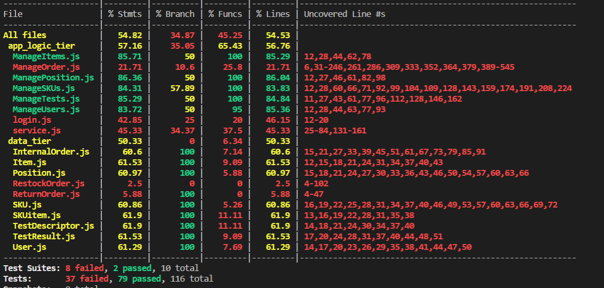

# Unit Testing Report

Date:

Version:

# Contents

- [Black Box Unit Tests](#black-box-unit-tests)

- [White Box Unit Tests](#white-box-unit-tests)

# Black Box Unit Tests

    <Define here criteria, predicates and the combination of predicates for each function of each class.
    Define test cases to cover all equivalence classes and boundary conditions.
    In the table, report the description of the black box test case and (traceability) the correspondence with the Jest test case writing the 
    class and method name that contains the test case>
    <Jest tests  must be in code/server/unit_test  >

 ### **Class *ManageOrder.js* - method *getAllRestockOrders***

**Criteria for method *getAllRestockOrders*:**
	
 - Right data of database rows

**Predicates for method *getAllRestockOrders*:**

| Criteria | Predicate |
| -------- | --------- |
| Right data of database rows | true |
|          | false |

**Boundaries**:
 
| -------- | --------------- |
|          |                 |
|          |                 |

**Combination of predicates**:

| Right data of database rows | Valid / Invalid | Description of the test case | Jest test case |
|-------|-------|-------|-------|
|| valid | getting all rows in the database about restock orders | testGetAllRestockOrders() |||

### **method *getIssuedRestockOrders***

**Criteria for method *getIssuedRestockOrders*:**
	
 - Right number of database rows

**Predicates for method *getIssuedRestockOrders*:**

| Criteria | Predicate |
| -------- | --------- |
| Right data of database rows | true |
|          | false |

**Boundaries**:
 
| -------- | --------------- |
|          |                 |
|          |                 |

**Combination of predicates**:

| Right number of database rows | Valid / Invalid | Description of the test case | Jest test case |
|-------|-------|-------|-------|
|| valid | getting all rows in the database only about restock orders | testGetIssuedRestockOrders() |||

### **method *getRestockOrderById*:**

**Criteria for method *getRestockOrderById*:**
	
 - Right data of database rows
 - Empty vector in case of id not found

**Predicates for method *getRestockOrderById*:**

| Criteria | Predicate |
| -------- | --------- |
| Right number of database rows | true |
|          | false |
| Empty vector in case of id not found | true |
| |false|

**Boundaries**:
 
| -------- | --------------- |
|          |                 |
|          |                 |

**Combination of predicates**:

| Right number of database rows | Empty vector in case of id not found | Valid / Invalid | Description of the test case | Jest test case |
|-------|-------|-------|-------|-------|
|true|false| valid | get a vector with the restock order with the specified id | testGetRestockOrderById(id, expecedOutput) |
| true | true | invalid | | |
| false | true | valid | get an empty vector | testGetRestockOrderById(id, []) |
| false | false | invalid|||

### **method *getRestockOrderSKUitems*:**

**Criteria for method *getRestockOrderSKUitems*:**
	
 - Right data of the database rows
 - Empty vector in case of id not found

**Predicates for method *getRestockOrderSKUitems*:**

| Criteria | Predicate |
| -------- | --------- |
| Right data of database rows | true |
|          | false |
| Empty vector in case of id not found | true|
||false| 

**Boundaries**:
 
| -------- | --------------- |
|          |                 |
|          |                 |

**Combination of predicates**:

| Right number of database rows | Empty vector in case of id not found | Valid / Invalid | Description of the test case | Jest test case |
|-------|-------|-------|-------|-------|
|true|false| valid | get a vector with the restock order with the specified id | testGetItemsFromRestockOrderById(id, expectedValue) |
| true | true | invalid | | |
| false | true | valid | get an empty vector | testGetItemsFromRestockOrderById(id, [])|
| false | false | invalid|||

### **method *createRestockOrder*:**

**Criteria for method *createRestockOrder*:**
	
 - No SQLError raised

**Predicates for method *createRestockOrder*:**

| Criteria | Predicate |
| -------- | --------- |
| NO SQLError raised | true |
|| false| 

**Boundaries**:
 
| -------- | --------------- |
|          |                 |
|          |                 |

**Combination of predicates**:

| No SQLError raised | Valid / Invalid | Description of the test case | Jest test case |
|-------|-------|-------|-------|
| true | valid | creation of restock order | testCreateRestockOrder(RestockOrder) |

### **method *updateStatus*:**

**Criteria for method *updateStatus*:**
	
 - No SQLError raised

**Predicates for method *updateStatus*:**

| Criteria | Predicate |
| -------- | --------- |
| NO SQLError raised | true |
|| false| 

**Boundaries**:
 
| -------- | --------------- |
|          |                 |
|          |                 |

**Combination of predicates**:

| No SQLError raised | Valid / Invalid | Description of the test case | Jest test case |
|-------|-------|-------|-------|
| true | valid | creation of restock order | testUpdateStatus(newStatus,expectedOutput) |

### **method *insertSKUItems*:**

**Criteria for method *insertSKUItems*:**
	
 - No SQLError raised
 - Unique RFID

**Predicates for method *insertSKUItems*:**

| Criteria | Predicate |
| -------- | --------- |
| NO SQLError raised | true |
|| false| 
| Unique RFID | true |
||false|

**Boundaries**:
 
| -------- | --------------- |
|          |                 |
|          |                 |

**Combination of predicates**:

| No SQLError raised | Unique RFID | Valid / Invalid | Description of the test case | Jest test case |
|-------|-------|-------|-------|-------|
| true | true |  valid | adding a vector of skuitems to a restock order with the specified id | testInsertSKUItems(id,newSKUItems, expectedOutput) |
| true | false | invalid |||
| false | false | invalid |||
| false | true | invalid |||

### **method *setTrasportNote*:**

**Criteria for method *setTrasportNote*:**
	
 - No SQLError raised

**Predicates for method *setTrasportNote*:**

| Criteria | Predicate |
| -------- | --------- |
| NO SQLError raised | true |
|| false| 

**Boundaries**:
 
| -------- | --------------- |
|          |                 |
|          |                 |

**Combination of predicates**:

| No SQLError raised | Valid / Invalid | Description of the test case | Jest test case |
|-------|-------|-------|-------|
| true |  valid | adding a transport note  to a restock order with the specified id | testSetTrasportNote(id, trasportNote, expectedOutput) |

### **method *deleteRestockOrder*:**

**Criteria for method *deleteRestockOrder*:**
	
 - No SQLError raised

**Predicates for method *deleteRestockOrder*:**

| Criteria | Predicate |
| -------- | --------- |
| NO SQLError raised | true |
|| false| 

**Boundaries**:
 
| -------- | --------------- |
|          |                 |
|          |                 |

**Combination of predicates**:

| No SQLError raised | Valid / Invalid | Description of the test case | Jest test case |
|-------|-------|-------|-------|
| true |  valid | adding a transport note  to a restock order with the specified id | testDeleteRestockOrder(id, expectedOutput) |

### **method *getAllReturnOrder*:**

**Criteria for method *getAllReturnOrders*:**
	
 - Right data of database rows

**Predicates for method *getAllReturnOrders*:**

| Criteria | Predicate |
| -------- | --------- |
| Right data of database rows | true |
|          | false |

**Boundaries**:
 
| -------- | --------------- |
|          |                 |
|          |                 |

**Combination of predicates**:

| Right data of database rows | Valid / Invalid | Description of the test case | Jest test case |
|-------|-------|-------|-------|
|| valid | getting all rows in the database about return orders | testGetAllReturnOrders() |||

### **method *getReturnOrderById*:**

**Criteria for method *getReturnOrderById*:**
	
 - Right data of database rows
 - Empty vector in case of id not found

**Predicates for method *getReturnOrderById*:**

| Criteria | Predicate |
| -------- | --------- |
| Right data of database rows | true |
|          | false |
| Empty vector in case of id not found | true|
||false| 

**Boundaries**:
 
| -------- | --------------- |
|          |                 |
|          |                 |

**Combination of predicates**:

| Right number of database rows | Empty vector in case of id not found | Valid / Invalid | Description of the test case | Jest test case |
|-------|-------|-------|-------|-------|
|true|false| valid | get a vector with the restock order with the specified id | testGetReturnOrderById(id, expecedOutput) |
| true | true | invalid | | |
| false | true | valid | get an empty vector | testGetReturnOrderById(id, []) |
| false | false | invalid|||

### **method *createReturnOrder*:**

**Criteria for method *createReturnOrder*:**
	
 - No SQLError raised

**Predicates for method *createReturnOrder*:**

| Criteria | Predicate |
| -------- | --------- |
| NO SQLError raised | true |
|| false| 

**Boundaries**:
 
| -------- | --------------- |
|          |                 |
|          |                 |

**Combination of predicates**:

| No SQLError raised | Valid / Invalid | Description of the test case | Jest test case |
|-------|-------|-------|-------|
| true | valid | creation of restock order | testCreateReturnOrder(ReturnOrder)|

### **method *deleteReturnOrder*:**

**Criteria for method *deleteReturnOrder*:**
	
 - No SQLError raised

**Predicates for method *deleteReturnOrder*:**

| Criteria | Predicate |
| -------- | --------- |
| NO SQLError raised | true |
|| false| 

**Boundaries**:
 
| -------- | --------------- |
|          |                 |
|          |                 |

**Combination of predicates**:

| No SQLError raised | Valid / Invalid | Description of the test case | Jest test case |
|-------|-------|-------|-------|
| true |  valid | adding a transport note  to a restock order with the specified id | testDeleteReturnOrder(id, expectedOutput) |

### **method *getAllInternalOrders*:**

**Criteria for method *getAllInternalOrders*:**
	
 - Right data of database rows

**Predicates for method *getAllInternalOrders*:**

| Criteria | Predicate |
| -------- | --------- |
| Right data of database rows | true |
|          | false |

**Boundaries**:
 
| -------- | --------------- |
|          |                 |
|          |                 |

**Combination of predicates**:

| Right data of database rows | Valid / Invalid | Description of the test case | Jest test case |
|-------|-------|-------|-------|
|| valid | getting all rows in the database about internal orders | testGetAllInternalOrders(allInternalOrders) |||

### **method *getIssuedInternalOrder***

**Criteria for method *getIssuedInternalOrder*:**
	
 - STATE of internal order = ISSUED

**Predicates for method *getIssuedInternalOrder*:**

| Criteria | Predicate |
| -------- | --------- |
| STATE of internal order = ISSUED | true |
|          | false |

**Boundaries**:
 
| -------- | --------------- |
|          |                 |
|          |                 |

**Combination of predicates**:

| Right number of database rows | Valid / Invalid | Description of the test case | Jest test case |
|-------|-------|-------|-------|
|| valid | getting all rows in the database about internal orders with state = ISSUED | testGetIssuedInternalOrders(issuedInternalOrders); |||

### **method *getAcceptedInternalOrder*:**

**Criteria for method *getAcceptedInternalOrder*:**
	
 - Right data of database rows
 
**Predicates for method *getAcceptedInternalOrder*:**

| Criteria | Predicate |
| -------- | --------- |
| Right number of database rows | true |
|          | false |

**Boundaries**:
 
| -------- | --------------- |
|          |                 |

**Combination of predicates**:

| Right number of database rows | Valid / Invalid | Description of the test case | Jest test case |
|-------|-------|-------|-------|
|| valid | getting all rows in the database about internal orders with state = Accepted | testGetAcceptedInternalOrder(acceptedInternalOrder) |||

### **method *getInternalOrderById*:**

**Criteria for method *getInternalOrderById*:**
	
 - Right data of the database rows
 
**Predicates for method *getInternalOrderById*:**

| Criteria | Predicate |
| -------- | --------- |
| Right data of database rows | true |
|          | false |

**Boundaries**:
 
| -------- | --------------- |
|          |                 |

**Combination of predicates**:

| Right number of database rows | Valid / Invalid | Description of the test case | Jest test case |
|-------|-------|-------|-------|
|| valid | getting all rows in the database about internal orders given its id | testGetInternalOrderById(2, internalOrderById); |||

### **method *createInternalOrder*:**

**Criteria for method *createInternalOrder*:**
	
 - No SQLError raised

**Predicates for method *createInternalOrder*:**

| Criteria | Predicate |
| -------- | --------- |
| NO SQLError raised | true |
|| false| 

**Boundaries**:
 
| -------- | --------------- |
|          |                 |
|          |                 |

**Combination of predicates**:

| No SQLError raised | Valid / Invalid | Description of the test case | Jest test case |
|-------|-------|-------|-------|
| true | valid | creation of internal order | testCreateInternalOrder(io); |

### **method *updateInternalOrder*:**

**Criteria for method *updateInternalOrder*:**
	
 - No SQLError raised

**Predicates for method *updateInternalOrder*:**

| Criteria | Predicate |
| -------- | --------- |
| NO SQLError raised | true |
|| false| 

**Boundaries**:
 
| -------- | --------------- |
|          |                 |
|          |                 |

**Combination of predicates**:

| No SQLError raised | Valid / Invalid | Description of the test case | Jest test case |
|-------|-------|-------|-------|
| true | valid | updating the internal order given its id | testUpdateInternalOrder(newState, skuItems ,expectedOutput) |

### **method *deleteInternalOrder*:**

**Criteria for method *deleteInternalOrder*:**
	
 - No SQLError raised

**Predicates for method *deleteInternalOrder*:**

| Criteria | Predicate |
| -------- | --------- |
| NO SQLError raised | true |
|| false| 

**Boundaries**:
 
| -------- | --------------- |
|          |                 |
|          |                 |

**Combination of predicates**:

| No SQLError raised | Valid / Invalid | Description of the test case | Jest test case |
|-------|-------|-------|-------|
| true |  valid | deleting internal order given its Id | testDeleteInternalOrder(expectedOutput) |

### **Class *ManageTests.js* - method *getAllTestDescriptors***

**Criteria for method *getAllTestDescriptors*:**
	
 - Data is present in database

**Predicates for method *getAllTestDescriptors*:**

| Criteria | Predicate |
| -------- | --------- |
| Data is present in database | true |
|| false| 

**Boundaries**:
 
| -------- | --------------- |
|          |                 |
|          |                 |

**Combination of predicates**:

| Data is present in database | True / False | Description of the test case | Jest test case |
|-------|-------|-------|-------|
|  | true  | getting all rows from the database about descriptors | testGetAllTestDescriptors() |

### **method *getTestDescriptorById*:**

**Criteria for method *getTestDescriptorById*:**
	
 - Id is number
 - Id is present in database
 
**Predicates for method *getTestDescriptorById*:**

| Criteria | Predicate |
| -------- | --------- |
| Id is number | true |
|| false| 
| Id is present in database| true |
|| false| 
**Boundaries**:

| Criteria |  Boundary       | 
| -------- | --------------- |
| Id is number  |   Id>0  |

**Combination of predicates**:

|Id is number| Id is present in database | Valid / Invalid | Description of the test case | Jest test case |
|-------|-------|-------|-------|-------|
| true | true |  valid | get a row with the test descriptor with the specified id | testGetTestDescriptor(expTestDescriptor) |
| true | false | invalid|||
| false| true | invalid|||	
| false| false | invalid|||

### **method *addNewTestDescriptor*:**

**Criteria for method *addNewTestDescriptor*:**
	
 - No SQLError raised
 
 
**Predicates for method *getTestDescriptorById*:**

| Criteria | Predicate |
| -------- | --------- |
| NO SQLError raised | true |
|| false| 

**Boundaries**:

|  |       | 
| -------- | --------------- |
|   |     |

**Combination of predicates**:

| NO SQLError raised | Valid / Invalid | Description of the test case | Jest test case |
|-------|-------|-------|-------|
| true |  valid | adding new test descriptor to the database | testCreateTestDescriptor(newTestDescriptor) |

### **method *modifyTestDescriptor*:**

**Criteria for method *modifyTestDescriptor*:**
	
 - Data is present in database

**Predicates for method *modifyTestDescriptor*:**

| Criteria | Predicate |
| -------- | --------- |
| Data is present in database | true |
|| false| 

**Boundaries**:
 
| -------- | --------------- |
|          |                 |
|          |                 |

**Combination of predicates**:

| Data is present in database | True / False | Description of the test case | Jest test case |
|-------|-------|-------|-------|
|  | true  | updating the content of the row given id of test descriptor | testModifyTestDescriptor(newTestDescriptor.id, newTestDescriptor2, newTestDescriptor2exp)

 ### **method *deleteTestDescriptor*:**

**Criteria for method *deleteTestDescriptor*:**
	
 - No SQLError raised

**Predicates for method *deleteTestDescriptor*:**

| Criteria | Predicate |
| -------- | --------- |
| NO SQLError raised | true |
|| false| 

**Boundaries**:
 
| -------- | --------------- |
|          |                 |
|          |                 |

**Combination of predicates**:

| No SQLError raised | Valid / Invalid | Description of the test case | Jest test case |
|-------|-------|-------|-------|
| true |  valid | deleting test descriptor given its id | testDeleteTestDescriptor(newTestDescriptor.id) |

### **method *getAllTestResults*:**

**Criteria for method *getAllTestResults*:**
	
 - rfid is present in database

**Predicates for method *getAllTestResults*:**

| Criteria | Predicate |
| -------- | --------- |
| rfid is present in database | true |
|| false| 

**Boundaries**:
 
| -------- | --------------- |
|          |                 |

**Combination of predicates**:

| rfid is present in database | True / False | Description of the test case | Jest test case |
|-------|-------|-------|-------|
|  | true  | getting all rows about test results given rfid | testGetAllTestResults(allTestResultsByRfid) |

### **method *getTestResultById*:**

**Criteria for method *getTestResultById*:**
	
 - Id is number
 - Id is present in database
 
**Predicates for method *getTestResultById*:**

| Criteria | Predicate |
| -------- | --------- |
| Id is number | true |
|| false| 
| Id is present in database| true |
|| false| 

**Boundaries**:
| Criteria |  Boundary       | 
| -------- | --------------- |
| Id is number  |   Id>0  |

**Combination of predicates**:

|Id is number| Id is present in database | Valid / Invalid | Description of the test case | Jest test case |
|-------|-------|-------|-------|-------|
| true | true |  valid | getting a row with the test result with the specified id and rfid | testGetTestResultById(expTestResult) |
| true | false | invalid|||
| false| true | invalid|||	
| false| false | invalid|||

### **method *addNewTestResult*:**

**Criteria for method *addNewTestResult*:**
	
 - No SQLError raised
 
 
**Predicates for method *addNewTestResult*:**

| Criteria | Predicate |
| -------- | --------- |
| NO SQLError raised | true |
|| false| 

**Boundaries**:

|  |       | 
| -------- | --------------- |
|   |     |

**Combination of predicates**:

| NO SQLError raised | Valid / Invalid | Description of the test case | Jest test case |
|-------|-------|-------|-------|
| true |  valid | adding new test result | testCreateTestResult(newTestResult) |

### **method *modifyTestResult*:**

**Criteria for method *modifyTestResult*:**
	
 - Data is present in database

**Predicates for method *modifyTestResult*:**

| Criteria | Predicate |
| -------- | --------- |
| Data is present in database | true |
|| false| 

**Boundaries**:
 
| -------- | --------------- |
|          |                 |
|          |                 |

**Combination of predicates**:

| Data is present in database | True / False | Description of the test case | Jest test case |
|-------|-------|-------|-------|
|  | true  | updating the content of the row given id and rfid of test result | testModifyTestResult(newTestResult.id,newTestResult.rfid, newTestResult2, newTestResultexp)|

 ### **method *deleteTestResult*:**

**Criteria for method *deleteTestResult*:**
	
 - No SQLError raised

**Predicates for method *deleteTestResult*:**

| Criteria | Predicate |
| -------- | --------- |
| NO SQLError raised | true |
|| false| 

**Boundaries**:
 
| -------- | --------------- |
|          |                 |

**Combination of predicates**:

| No SQLError raised | Valid / Invalid | Description of the test case | Jest test case |
|-------|-------|-------|-------|
| true |  valid | deleting test result given its id | testDeleteTestResult(id) |

 ### **Class *ManageItems.js* - method *getAllItem***

**Criteria for method *getAllItem*:**
	
 - Right datas and types in returned object

**Predicates for method *getAllItem*:**

| Criteria | Predicate |
| -------- | --------- |
| Right datas and types in returned object | true |
|          | false |

**Boundaries**:
 
| -------- | --------------- |
|          |                 |
|          |                 |

**Combination of predicates**:

| Right datas and types in returned object | Valid / Invalid | Description of the test case | Jest test case |
|-------|-------|-------|-------|
|| valid | getting all rows in the database from item table | testGetAllItem(expectedOutput) |||

### **method *getItem***

**Criteria for method *getItem*:**
	
 - Right datas and types in returned object

**Predicates for method *getItem*:**

| Criteria | Predicate |
| -------- | --------- |
| Right datas and types in returned object | true |
|          | false |

**Boundaries**:
 
| -------- | --------------- |
|          |                 |
|          |                 |

**Combination of predicates**:

| Right datas and types in returned object | Valid / Invalid | Description of the test case | Jest test case |
|-------|-------|-------|-------|
|| valid | getting one row corresponding to specified ID from item table | testGetItem(id, expectedOutput) |||

### **method *addNewItem*:**

**Criteria for method *addNewItem*:**
	
 - No errors when item is added 
 - Added item present in database after addition

**Predicates for method *addNewItem*:**

| Criteria | Predicate |
| -------- | --------- |
| No errors when item is added | true |
|          | false |
| Added item present in database after addition | true |
| |false|

**Boundaries**:
 
| -------- | --------------- |
|          |                 |
|          |                 |

**Combination of predicates**:

|  No errors when item is added | Added item present in database after addition| Valid / Invalid | Description of the test case | Jest test case |
|-------|-------|-------|-------|-------|
| true  | true  | valid | getting one row corresponding to the added item from item table | testCreateItem(newItem) |
| true  | false | invalid | | |
| false | true  | invalid |||
| false | false | invalid|||

### **method *modifyItem*:**

**Criteria for method *modifyItem*:**
	
 - No errors when item is updated
 - Updated item present in database after update

**Predicates for method *modifyItem*:**

| Criteria | Predicate |
| -------- | --------- |
| No errors when item is updated | true |
|          | false |
| Updated item present in database after update | true |
| |false|

**Boundaries**:
 
| -------- | --------------- |
|          |                 |
|          |                 |

**Combination of predicates**:

|  No errors when item is updated | Updated item present in database after update | Valid / Invalid | Description of the test case | Jest test case |
|-------|-------|-------|-------|-------|
| true  | true  | valid | getting one row corresponding to the updated item from item table | testModifyItem(id, newItem, expectedOutput) |
| true  | false | invalid | | |
| false | true  | invalid |||
| false | false | invalid|||

### **method *deleteItem*:**

**Criteria for method *deleteItem*:**
	
 - No errors when item is deleted

**Predicates for method *deleteItem*:**

| Criteria | Predicate |
| -------- | --------- |
| No errors when item is deleted | true |
|          | false |

**Boundaries**:
 
| -------- | --------------- |
|          |                 |
|          |                 |

**Combination of predicates**:

|  No errors when item is deleted | Valid / Invalid | Description of the test case | Jest test case |
|-------|-------|-------|-------|
| |  valid | no response | testDeleteItem(id) |

 ### **Class *ManageSKUs.js* - method *getAllSKU***

**Criteria for method *getAllSKU*:**
	
 - Right datas and types in returned object

**Predicates for method *getAllSKU*:**

| Criteria | Predicate |
| -------- | --------- |
| Right datas and types in returned object | true |
|          | false |

**Boundaries**:
 
| -------- | --------------- |
|          |                 |
|          |                 |

**Combination of predicates**:

| Right datas and types in returned object | Valid / Invalid | Description of the test case | Jest test case |
|-------|-------|-------|-------|
|| valid | getting all rows in the database from SKU table | testGetAllSKU(expectedOutput) |||

### **method *getSKU***

**Criteria for method *getSKU*:**
	
 - Right datas and types in returned object

**Predicates for method *getSKU*:**

| Criteria | Predicate |
| -------- | --------- |
| Right datas and types in returned object | true |
|          | false |

**Boundaries**:
 
| -------- | --------------- |
|          |                 |
|          |                 |

**Combination of predicates**:

| Right datas and types in returned object | Valid / Invalid | Description of the test case | Jest test case |
|-------|-------|-------|-------|
|| valid | getting one row corresponding to specified ID from SKU table | testGetSKU(id, expectedOutput) |||

### **method *addNewSKU*:**

**Criteria for method *addNewSKU*:**
	
 - No errors when SKU is added 
 - Added SKU present in database after addition

**Predicates for method *addNewSKU*:**

| Criteria | Predicate |
| -------- | --------- |
| No errors when SKU is added | true |
|          | false |
| Added SKU present in database after addition | true |
| |false|

**Boundaries**:
 
| -------- | --------------- |
|          |                 |
|          |                 |

**Combination of predicates**:

|  No errors when SKU is added |  Added SKU present in database after addition | Valid / Invalid | Description of the test case | Jest test case |
|-------|-------|-------|-------|-------|
| true  | true  | valid | getting one row corresponding to the added SKU from SKU table | testCreateSKU(newsku) |
| true  | false | invalid | | |
| false | true  | invalid |||
| false | false | invalid|||

### **method *modifySKU*:**

**Criteria for method *modifySKU*:**
	
 - No errors when SKU is updated
 - Updated SKU present in database after update

**Predicates for method *modifySKU*:**

| Criteria | Predicate |
| -------- | --------- |
| No errors when SKU is updated | true |
|          | false |
| Updated SKU present in database after update | true |
| |false|

**Boundaries**:
 
| -------- | --------------- |
|          |                 |
|          |                 |

**Combination of predicates**:

|  No errors when SKU is updated |  Updated SKU present in database after update | Valid / Invalid | Description of the test case | Jest test case |
|-------|-------|-------|-------|-------|
| true  | true  | valid | getting one row corresponding to the updated SKU from SKU table | testModifySKU(id, newSKU, expectedOutput) |
| true  | false | invalid | | |
| false | true  | invalid |||
| false | false | invalid|||

### **method *modifySKUposition*:**

**Criteria for method *modifySKUposition*:**
	
 - No errors when SKU and position are updated
 - Updated SKU present in database after update

**Predicates for method *modifySKUposition*:**

| Criteria | Predicate |
| -------- | --------- |
| No errors when SKU and position are updated | true |
|          | false |
| Updated SKU present in database after update | true |
| |false|

**Boundaries**:
 
| -------- | --------------- |
|          |                 |
|          |                 |

**Combination of predicates**:

|  No errors when SKU and position are updated |  Updated SKU present in database after updat | Valid / Invalid | Description of the test case | Jest test case |
|-------|-------|-------|-------|-------|
| true  | true  | valid | getting one row corresponding to the updated SKU from SKU table | testModifySKUposition(id, newSKU, expectedOutput) |
| true  | false | invalid | | |
| false | true  | invalid |||
| false | false | invalid|||

### **method *deleteSKU*:**

**Criteria for method *deleteSKU*:**
	
 - No errors when SKU is deleted

**Predicates for method *deleteSKU*:**

| Criteria | Predicate |
| -------- | --------- |
| No errors when SKU is deleted | true |
|          | false |

**Boundaries**:
 
| -------- | --------------- |
|          |                 |
|          |                 |

**Combination of predicates**:

|  No errors when SKU is deleted | Valid / Invalid | Description of the test case | Jest test case |
|-------|-------|-------|-------|
| |  valid | no response | testDeleteSKU(id) |

 ###  method *getAllSKUitem***

**Criteria for method *getAllSKUitem*:**
	
 - Right datas and types in returned object

**Predicates for method *getAllSKUitem*:**

| Criteria | Predicate |
| -------- | --------- |
| Right datas and types in returned object | true |
|          | false |

**Boundaries**:
 
| -------- | --------------- |
|          |                 |
|          |                 |

**Combination of predicates**:

| Right datas and types in returned object | Valid / Invalid | Description of the test case | Jest test case |
|-------|-------|-------|-------|
|| valid | getting all rows in the database from SKUItem table | testGetAllSKUitem(expectedOutput) |||

### **method *getSKUitem***

**Criteria for method *getVitem*:**
	
 - Right datas and types in returned object

**Predicates for method *getSKUitem*:**

| Criteria | Predicate |
| -------- | --------- |
| Right datas and types in returned object | true |
|          | false |

**Boundaries**:
 
| -------- | --------------- |
|          |                 |
|          |                 |

**Combination of predicates**:

| Right datas and types in returned object | Valid / Invalid | Description of the test case | Jest test case |
|-------|-------|-------|-------|
|| valid | getting one row corresponding to specified ID from SKUitem table | testGetSKUitem(id, expectedOutput) |||

### **method *addNewSKUitem*:**

**Criteria for method *addNewSKUitem*:**
	
 - No errors when SKUitem is added 
 - Added item present in database after addition

**Predicates for method *addNewSKUitem*:**

| Criteria | Predicate |
| -------- | --------- |
| No errors when SKUitem is added | true |
|          | false |
| Added SKUitem present in database after addition | true |
| |false|

**Boundaries**:
 
| -------- | --------------- |
|          |                 |
|          |                 |

**Combination of predicates**:

|  No errors when SKUitem is added | Added SKUitem present in database after addition| Valid / Invalid | Description of the test case | Jest test case |
|-------|-------|-------|-------|-------|
| true  | true  | valid | getting one row corresponding to the added SKUitem from SKUitem table | testCreateSKUitem(newskuitem) |
| true  | false | invalid | | |
| false | true  | invalid |||
| false | false | invalid|||

### **method *modifySKUitem*:**

**Criteria for method *modifySKUitem*:**
	
 - No errors when SKUitem is updated
 - Updated SKUitem present in database after update

**Predicates for method *modifyItem*:**

| Criteria | Predicate |
| -------- | --------- |
| No errors when SKUitem is updated | true |
|          | false |
| Updated SKUitem present in database after update | true |
| |false|

**Boundaries**:
 
| -------- | --------------- |
|          |                 |
|          |                 |

**Combination of predicates**:

|  No errors when SKUitem is updated | Updated SKUitem present in database after update | Valid / Invalid | Description of the test case | Jest test case |
|-------|-------|-------|-------|-------|
| true  | true  | valid | getting one row corresponding to the updated SKUitem from SKUitem table | testModifySKUitem(id, newSKUitem, expectedOutput) |
| true  | false | invalid | | |
| false | true  | invalid |||
| false | false | invalid|||

 ###  method *getSKUitemBySKU***

**Criteria for method *getSKUitemBySKU*:**
	
 - Right datas and types in returned object

**Predicates for method *getSKUitemBySKU*:**

| Criteria | Predicate |
| -------- | --------- |
| Right datas and types in returned object | true |
|          | false |

**Boundaries**:
 
| -------- | --------------- |
|          |                 |
|          |                 |

**Combination of predicates**:

| Right datas and types in returned object | Valid / Invalid | Description of the test case | Jest test case |
|-------|-------|-------|-------|
|| valid | getting all rows in the database from SKUItem table with a given SKUid | testGedSKUitemBySKU(id, expectedOutput) |||

### **method *deleteSKUitem*:**

**Criteria for method *deleteSKUitem*:**
	
 - No errors when SKUitem is deleted

**Predicates for method *deleteSKUitem*:**

| Criteria | Predicate |
| -------- | --------- |
| No errors when SKUitem is deleted | true |
|          | false |

**Boundaries**:
 
| -------- | --------------- |
|          |                 |
|          |                 |

**Combination of predicates**:

|  No errors when SKUitem is deleted | Valid / Invalid | Description of the test case | Jest test case |
|-------|-------|-------|-------|
| |  valid | no response | testDeleteSKUitem(id) |

### **Class *ManagePosition.js* - method *getAllPosition***

**Criteria for method *getAllPosition*:**
	
 - Right datas and types in returned object

**Predicates for method *getAllPosition*:**

| Criteria | Predicate |
| -------- | --------- |
| Right datas and types in returned object | true |
|          | false |

**Boundaries**:
 
| -------- | --------------- |
|          |                 |
|          |                 |

**Combination of predicates**:

| Right datas and types in returned object | Valid / Invalid | Description of the test case | Jest test case |
|-------|-------|-------|-------|
|| valid | getting all rows in the database from position table | testGetAllPosition(expectedOutput) |||

### **method *getPosition***

**Criteria for method *getPosition*:**
	
 - Right datas and types in returned object

**Predicates for method *getPosition*:**

| Criteria | Predicate |
| -------- | --------- |
| Right datas and types in returned object | true |
|          | false |

**Boundaries**:
 
| -------- | --------------- |
|          |                 |
|          |                 |

**Combination of predicates**:

| Right datas and types in returned object | Valid / Invalid | Description of the test case | Jest test case |
|-------|-------|-------|-------|
|| valid | getting one row corresponding to specified ID from Position table | testGetPosition(id, expectedOutput) |||

### **method *addNewPosition*:**

**Criteria for method *addNewPosition*:**
	
 - No errors when position is added 
 - Added position present in database after addition

**Predicates for method *addNewPosition*:**

| Criteria | Predicate |
| -------- | --------- |
| No errors when position is added | true |
|          | false |
| Added position present in database after addition | true |
| |false|

**Boundaries**:
 
| -------- | --------------- |
|          |                 |
|          |                 |

**Combination of predicates**:

|  No errors when position is added | Added position present in database after addition| Valid / Invalid | Description of the test case | Jest test case |
|-------|-------|-------|-------|-------|
| true  | true  | valid | getting one row corresponding to the added position from position table | testCreatePosition(newPosition) |
| true  | false | invalid | | |
| false | true  | invalid |||
| false | false | invalid|||

### **method *modifyPosition*:**

**Criteria for method *modifyPosition*:**
	
 - No errors when position is updated
 - Updated position present in database after update

**Predicates for method *modifyPosition*:**

| Criteria | Predicate |
| -------- | --------- |
| No errors when position is updated | true |
|          | false |
| Updated position present in database after update | true |
| |false|

**Boundaries**:
 
| -------- | --------------- |
|          |                 |
|          |                 |

**Combination of predicates**:

|  No errors when position is updated | Updated position present in database after update | Valid / Invalid | Description of the test case | Jest test case |
|-------|-------|-------|-------|-------|
| true  | true  | valid | getting one row corresponding to the updated position from position table | testModifyPosition(id, newPosition, expectedOutput) |
| true  | false | invalid | | |
| false | true  | invalid |||
| false | false | invalid|||

### **method *modifyPositionID*:**

**Criteria for method *modifyPositionID*:**
	
 - No errors when position is updated
 - Updated position present in database after update

**Predicates for method *modifyPositionID*:**

| Criteria | Predicate |
| -------- | --------- |
| No errors when position is updated | true |
|          | false |
| Updated position present in database after update | true |
| |false|

**Boundaries**:
 
| -------- | --------------- |
|          |                 |
|          |                 |

**Combination of predicates**:

|  No errors when position is updated | Updated position present in database after update | Valid / Invalid | Description of the test case | Jest test case |
|-------|-------|-------|-------|-------|
| true  | true  | valid | getting one row corresponding to the updated position from position table | testModifyPositionID(id, newPosition, expectedOutput) |
| true  | false | invalid | | |
| false | true  | invalid |||
| false | false | invalid|||

### **method *deletePosition*:**

**Criteria for method *deletePosition*:**
	
 - No errors when position is deleted

**Predicates for method *deletePosition*:**

| Criteria | Predicate |
| -------- | --------- |
| No errors when position is deleted | true |
|          | false |

**Boundaries**:
 
| -------- | --------------- |
|          |                 |
|          |                 |

**Combination of predicates**:

|  No errors when position is deleted | Valid / Invalid | Description of the test case | Jest test case |
|-------|-------|-------|-------|
| |  valid | no response | testDeletePosition(id) |

 ### **Class *ManageUsers.js* - method *getAllUsers***

**Criteria for method *getAllUsers*:**
	
 - Right datas and types in returned object

**Predicates for method *getAllUsers*:**

| Criteria | Predicate |
| -------- | --------- |
| Right datas and types in returned object | true |
|          | false |

**Boundaries**:
 
| -------- | --------------- |
|          |                 |
|          |                 |

**Combination of predicates**:

| Right datas and types in returned object | Valid / Invalid | Description of the test case | Jest test case |
|-------|-------|-------|-------|
|| valid | getting all rows in the database from user table | testGetAllUser(expectedOutput) |||

### method *getAllSuppliers*

**Criteria for method *getAllSuppliers*:**
	
 - Right datas and types in returned object

**Predicates for method *getAllSuppliers*:**

| Criteria | Predicate |
| -------- | --------- |
| Right datas and types in returned object | true |
|          | false |

**Boundaries**:
 
| -------- | --------------- |
|          |                 |
|          |                 |

**Combination of predicates**:

| Right datas and types in returned object | Valid / Invalid | Description of the test case | Jest test case |
|-------|-------|-------|-------|
|| valid | getting all rows in the database from user table | testGetAllSuppliers(expectedOutput) |||

### **method *getUser***

**Criteria for method *getUser*:**
	
 - Right datas and types in returned object

**Predicates for method *getUser*:**

| Criteria | Predicate |
| -------- | --------- |
| Right datas and types in returned object | true |
|          | false |

**Boundaries**:
 
| -------- | --------------- |
|          |                 |
|          |                 |

**Combination of predicates**:

| Right datas and types in returned object | Valid / Invalid | Description of the test case | Jest test case |
|-------|-------|-------|-------|
|| valid | getting one row corresponding to specified ID from user table | testGetUser(id, expectedOutput) |||

### **method *addNewUser*:**

**Criteria for method *addNewUser*:**
	
 - No errors when user is added 
 - Added user present in database after addition

**Predicates for method *addNewUser*:**

| Criteria | Predicate |
| -------- | --------- |
| No errors when user is added | true |
|          | false |
| Added user present in database after addition | true |
| |false|

**Boundaries**:
 
| -------- | --------------- |
|          |                 |
|          |                 |

**Combination of predicates**:

|  No errors when user is added | Added user present in database after addition| Valid / Invalid | Description of the test case | Jest test case |
|-------|-------|-------|-------|-------|
| true  | true  | valid | getting one row corresponding to the added user from user table | testCreateUser(newUser) |
| true  | false | invalid | | |
| false | true  | invalid |||
| false | false | invalid|||

### **method *modifyUser*:**

**Criteria for method *modifyUser*:**
	
 - No errors when user is updated
 - Updated user present in database after update

**Predicates for method *modifyUser*:**

| Criteria | Predicate |
| -------- | --------- |
| No errors when user is updated | true |
|          | false |
| Updated user present in database after update | true |
| |false|

**Boundaries**:
 
| -------- | --------------- |
|          |                 |
|          |                 |

**Combination of predicates**:

|  No errors when user is updated | Updated user present in database after update | Valid / Invalid | Description of the test case | Jest test case |
|-------|-------|-------|-------|-------|
| true  | true  | valid | getting one row corresponding to the updated user from user table | testModifyUser(olduser, types, expectedOutput) |
| true  | false | invalid | | |
| false | true  | invalid |||
| false | false | invalid|||

### **method *deleteUser*:**

**Criteria for method *deleteUser*:**
	
 - No errors when user is deleted

**Predicates for method *deleteUser*:**

| Criteria | Predicate |
| -------- | --------- |
| No errors when user is deleted | true |
|          | false |

**Boundaries**:
 
| -------- | --------------- |
|          |                 |
|          |                 |

**Combination of predicates**:

|  No errors when item is deleted | Valid / Invalid | Description of the test case | Jest test case |
|-------|-------|-------|-------|
| |  valid | no response | testDeleteUser(username, type) |

# White Box Unit Tests

### Test cases definition
    
    
    <Report here all the created Jest test cases, and the units/classes under test >
    <For traceability write the class and method name that contains the test case>

| Unit name | Jest test case |
|--|--|
|deleteRestockOrder(id)| testDeleteRestockOrder(expectedOutput)|
|getAllRestockOrder()| testGetAllRestockOrder(expectedOutput)|
|getIssuedRestockOrder()|testGetIssuedRestockOrder()|
|createRestockOrder(RestockOrder)|testCreateRestockOrder(restockOrder)|
|updateStatus(orderId, newState)| testUpdateStatus(newState,expectedOutput)|
|setRestockOrderSKUItems(id,newSKUItems)|testInsertSKUItems(newSKUItems)|
|setTrasportNoteRestockOrder(orderId,transportNote)|testInsertTransportNote(transportNote,expectedOutput)|
|getRestockOrderById(id)|testGetRestockOrderById(id,expectedOutput)|
|getItemsFromRestockOrder(id,expectedOutput)|testGetItemsFromRestockOrderById(id,expectedOutput)|
|getAllReturnOrder(id)|testGetAllReturnOrders(expectedOutput)|
|getReturnOrderById(id)|testGetReturnOrderById(id,expectedOutput)|
|createReturnOrder(returnOrder)|testCreateReturnOrder(returnOrder)|
|deleteReturnOrder()|testDeleteReturnOrder(id)|
|getAllInternalOrders()|testGetAllInternalOrders(allInternalOrders)|
|getIssuedInternalOrder()|testGetIssuedInternalOrders(issuedInternalOrders);|
|getAcceptedInternalOrder()|testGetAcceptedInternalOrder(acceptedInternalOrder)|
|getInternalOrderById(id)|testGetInternalOrderById(2,internalOrderById);|
|createInternalOrder(internalOrder)|testCreateInternalOrder(io)|
|updateInternalOrder(orderId, newState, products)|testUpdateInternalOrder(newState, skuItems ,expectedOutput)|
|deleteInternalOrder(orderId)|testDeleteInternalOrder(expectedOutput)|
|getAllTestDescriptors()|testGetAllTestDescriptors(allTestDescriptors)|
|getTestDescriptorById(id)|testGetTestDescriptor(expTestDescriptor)|
|addNewTestDescriptor(TestDescriptor)|testCreateTestDescriptor(newTestDescriptor)|
|modifyTestDescriptor(id, newTestDescriptor)|testModifyTestDescriptor(newTestDescriptor.id, newTestDescriptor2, newTestDescriptor2exp)|
|deleteTestDescriptor(id)|testDeleteTestDescriptor(newTestDescriptor.id)|
|getAllTestResults(rfid)|testGetAllTestResults(allTestResultsByRfid)|
|getTestResultById(id,rfid)|testGetTestResultById(expTestResult)|
|addNewTestResult(TestResult)|testCreateTestResult(newTestResult)|
|modifyTestResult(id,rfid, newTestResult)|testModifyTestResult(newTestResult.id,newTestResult.rfid, newTestResult2, newTestResultexp)|
|deleteTestResult(id)|testDeleteTestResult(newTestResult.id)|
|getAllItem()| testGetAllItem(expectedOutput)|
|getItem(id)|testGetItem(id, expectedOutput)|
|addNewItem(newItem)|testCreateItem(newItem)|
|modifyItem(id, newItem)|testModifyItem(id, newItem, expectedOutput)|
|deleteItem(id)|testDeleteItem(id)|
|getAllSKU()| testGetAllSKU(expectedOutput)|
|getSKU(id)|testGetSKU(id, expectedOutput)|
|addNewSKU(newSKU)|testCreateSKU(newSKU)|
|modifySKU(id, newSKU)|testModifySKU(id, newSKU, expectedOutput)|
|modifySKUposition(id, newPosition)|testModifySKUposition(id, newSKU, expectedOutput)|
|deleteSKU(id)|testDeleteSKU(id)|
|getAllSKUitem()| testGetAllSKUitem(expectedOutput)|
|getSKUitem(id)|testGetSKUitem(id, expectedOutput)|
|getSKUitemBySKU(id)|testGetSKUitemBySKU(id,expectedOutput)|
|addNewSKUitem(newSKUitem)|testCreateSKUitem(newSKUitem)|
|modifySKUitem(id, newSKUitem)|testModifySKUitem(id, newSKUitem, expectedOutput)|
|deleteSKUitem(id)|testDeleteSKUitem(id)|
|getAllPosition()| testGetAllPosition(expectedOutput)|
|getPosition(id)|testGetPosition(id, expectedOutput)|
|addNewPosition(newPosition)|testCreatePosition(newPosition)|
|modifyPosition(id, newPosition)|testModifyPosition(id, newPosition, expectedOutput)|
|modifyPositionID(id, newPosition)|testModifyPositionID(id, newPosition, expectedOutput)|
|deletePosition(id)|testDeletePosition(id)|
|getAllUser()| testGetAllUser(expectedOutput)|
|getAllSupplier()| testGetAllSupplier(expectedOutput)|
|getUser(id)|testGetUser(id, expectedOutput)|
|addNewUser(newUser)|testCreateUser(newUser)|
|modifyUser(id, newUser)|testModifyUser(id, newUser, expectedOutput)|
|deleteUser(id)|testDeleteUser(id)|

### Code coverage report

### Loop coverage analysis

    <Identify significant loops in the units and reports the test cases
    developed to cover zero, one or multiple iterations >

|Unit name | Loop rows | Number of iterations | Jest test case |
|---|---|---|---|
|createRestockOrder(ro)|144-150|2|testCreateRestockOrder(restockOrder)(restockOrder has 2 elements in the Products property)|
|setRestockOrderSKUItems(id,newSKUItems)|191-195,203-208|2,1|testInsertSKUItems(newSKUItems) (newSKUItems has 2 products with the same SKUid)|
|createReturnOrder(reo)|521-526|2|testCreateReturnOrder(returnOrder) (returnOrder has 2 elements in the Products property)|

